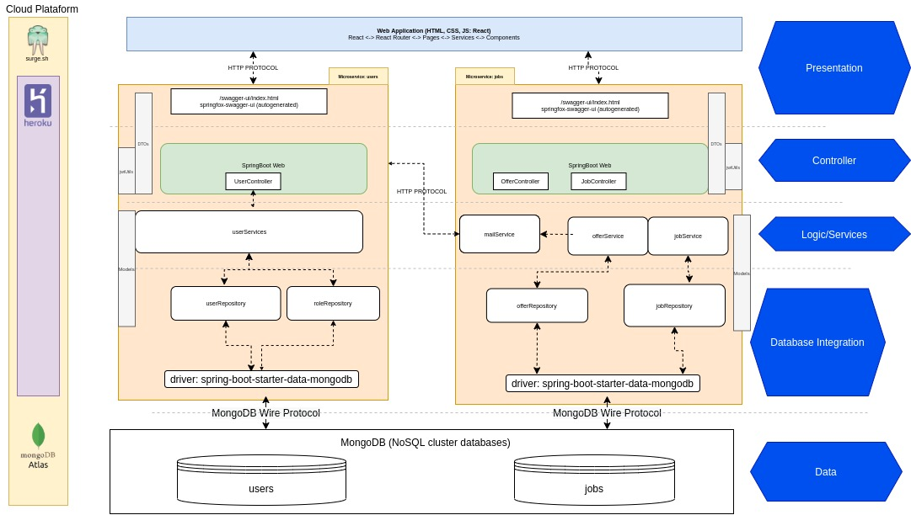
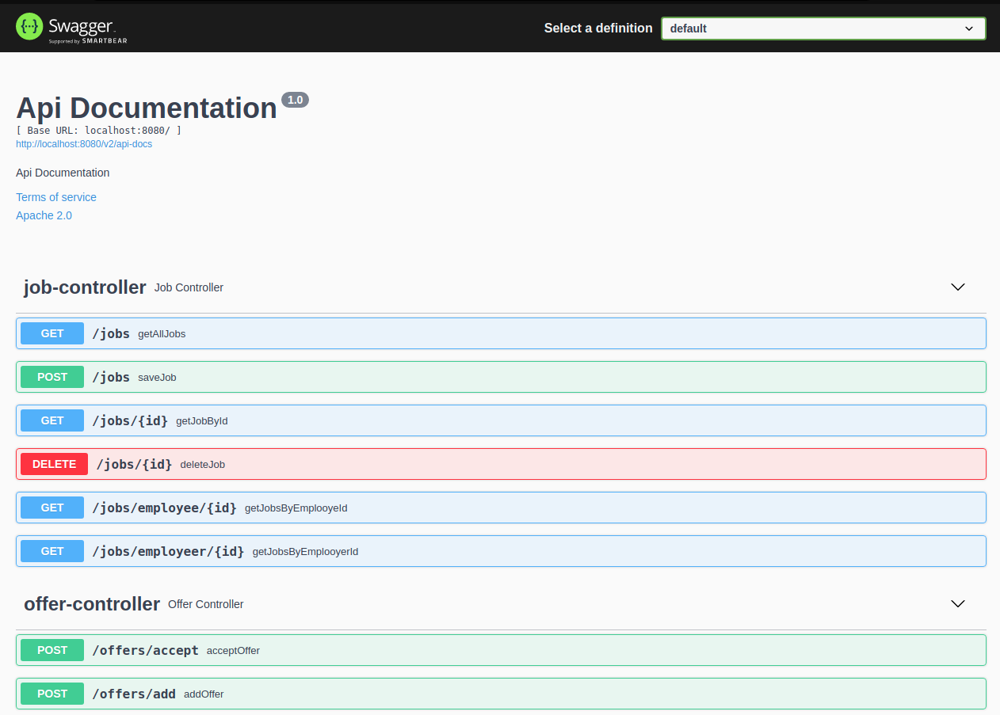

# baboonjobs-ms-jobs
Baboonjobs-ms-jobs is  a REST microservice for BaboonJobs. Its functionality is job/offers management
* Create jobs
* Create and accept offers
* Get jobs and offers


See Baboonjobs projects:
* baboonjobs-ms-users: https://github.com/baboondev/baboonjobs-ms-users 
* baboonjobs-ms-jobs: https://github.com/baboondev/baboonjobs-ms-jobs **(this project)**
* baboonjobs-frontend: https://github.com/baboondev/baboonjobs-frontend

## Table of contents

- [baboonjobs-ms-users](#baboonjobs-ms-users)
  * [Contents](#contents)
  * [About Baboonjobs](#about-baboonjobs)
    + [Architecture chart:](#architecture-chart-)
      - [Backend](#backend)
      - [Frontend](#frontend)
    + [Deploy](#deploy)
  * [Requirements](#requirements)
  * [Install and run](#install-and-run)
      - [Configure properties](#configure-properties)
  * [Database Documents Schemas](#database-documents-schemas)
      - [User](#user)
      - [Role](#role)
  * [Endpoints](#endpoints)
  * [Screenshots](#screenshots)

## About Baboonjobs
Baboonjobs is a web application for posting job offers and proposals. It is the integrative project for the subject "Java Application on Web" of the Computer Engineering course at the Arturo Jauretche National University.

### Architecture chart:


#### Backend

Microservices architecture was used for the backend. There were two microservices: users and jobs. Each of them is a REST service

These were developed in Java with spring boot as framework and both were documents with swagger. 
Regarding data persistence for both microservices, MongoDB (NoSQL database) was chosen. They are hosted in a Mongo Atlas cluster.

JWT (json web token) is used for application authentication using the packages provided by spring.

#### Frontend
For the frontend we used the React library to generate a SPA web application. As main dependencies we used react-router-dom for routing and Redux for state management.

The frontend connects to the endpoints of the backend microservices to obtain information. Access tokens are obtained in the user microservice.

### Deploy
The application is deployed on the following cloud services: 
* [Heroku](https://www.heroku.com/java) for Backend
* [Surge](https://surge.sh/) for Frontend
* [MongoDB Atlas](https://www.mongodb.com/atlas/database) for the database 

## Requirements 

+ Java JDK 17 https://jdk.java.net/17/
+ Apache Maven: https://maven.apache.org/
+ Mongo DB Database: https://www.mongodb.com/es/atlas


## Install and run

```shell
# Clone project
> git clone https://github.com/baboondev/baboonjobs-ms-jobs.git
> cd baboonjobs-ms-jobs
# After config properties, Install mvn dependencies
> mvn clean install
# Run
> mvn spring-boot:run
```
You can see others ways how to run a spring-boot application in this article: https://docs.spring.io/spring-boot/docs/2.0.x/reference/html/using-boot-running-your-application.html
#### Configure properties

Go to the file `src/main/resources/application.properties` and replace values
```
spring.data.mongodb.uri=YOUR_MONGODB_URI
spring.data.mongodb.database=YOUR_MONGO_DATABSE
server.port=PORT

spring.data.mongodb.uri=YOUR_MONGODB_URI
spring.data.mongodb.database=YOUR_MONGO_DATABSE
spring.mail.host=MAIL_HOST
spring.mail.port=MAIL_PORT
server.port=PORT
# Add mail and password real (same as host)
spring.mail.username=EMAIL_ADDRESS
spring.mail.password=EMAIL_PASSWORD

spring.mail.properties.mail.smtp.auth=true
spring.mail.properties.mail.smtp.starttls.enable=true
spring.mail.properties.mail.smtp.connectiontimeout=5000
spring.mail.properties.mail.smtp.timeout=5000
spring.mail.properties.mail.smtp.writetimeout=5000
spring.mail.properties.mail.smtp.writetimeout=5000
```

## Database Documents Schemas
#### Job
```javascript
Job {
    _id: ObjectId,
    authorId: ObjectId,
    groupJob: string,
    dateToWork: Date,
    location: {
    	address: string,
        city: string,
        country: string
    },
    description: string
    offers: [Offer]
    acceptedOffer: Offer
    createdAd: Date
}
```
#### Offer
```javascript
Offer {
	_id: ObjectId,
	jobId: ObjectId
	authorId: ObjectId,
	price: Double,
	description: string,
	createdAt: Date
}
```

## Endpoints
This is a brief overview of the endpoints. To see them in detail please visit the documentation generated in Swagger in your project at `<YOUR_URL_APP>/swagger-ui/index.html`

| Method   | Endpoint             | Description                                                  |
| :------- | :------------------- | ------------------------------------------------------------ |
| `GET`    | /jobs                | Get all jobs<br />**Header:** token=JWT_TOKEN<br />**Query**:<br />**Returns**: 200, 401 |
| `POST`   | /jobs                | Create a new Job (only for employeer user role)<br />**Header:** token=JWT_TOKEN<br />**Body**: `{   "dateToWork": "2021-12-06T02:59:56.114Z",   "description": "string",   "groupJob": "string",   "location": "string" }`<br /> **Returns**: 201, 401 |
| `GET`    | /jobs/{id}           | Get a job by id<br />**Header:** token=JWT_TOKEN<br />**Path**: id=string<br />**Returns**: 200, 401 |
| `DELETE` | /jobs/{id}           | Delete a job if <br />**Header:** token=JWT_TOKEN<br />**Path**: id=string<br />**Returns**: 200, 401 |
| `GET`    | /jobs/employee/{id}  | Get all jobs by a id for a employee <br />**Header:** token=JWT_TOKEN<br />**Path**: id=string<br />**Returns**: 200, 401 |
| `GET`    | /jobs/employeer/{id} | Get all jobs by a id for a employeer <br />**Header:** token=JWT_TOKEN<br />**Path**: id=string<br />**Returns**: 200, 401 |
| `POST`   | /offers/accept       | Accept a offer into a job (if user token is the author of a the job )<br />**Header:** token=JWT_TOKEN<br />**Body**: `{ "_id": "string", "authorId": "string", "createdAt": "2021-12-06T03:00:04.397Z", "jobId": "string", "price": 0 }`<br />**Returns**: 200, 401 |
| `POST`   | /offers/add          | Create  a offer into a job (if user token has role=employee )<br />**Header:** token=JWT_TOKEN<br />**Body**: `{ "authorId": "string", "jobId": "string", "price": 0, "description": "string" }`<br />**Returns**: 201, 401 |


## Screenshots

Swagger Docs:


